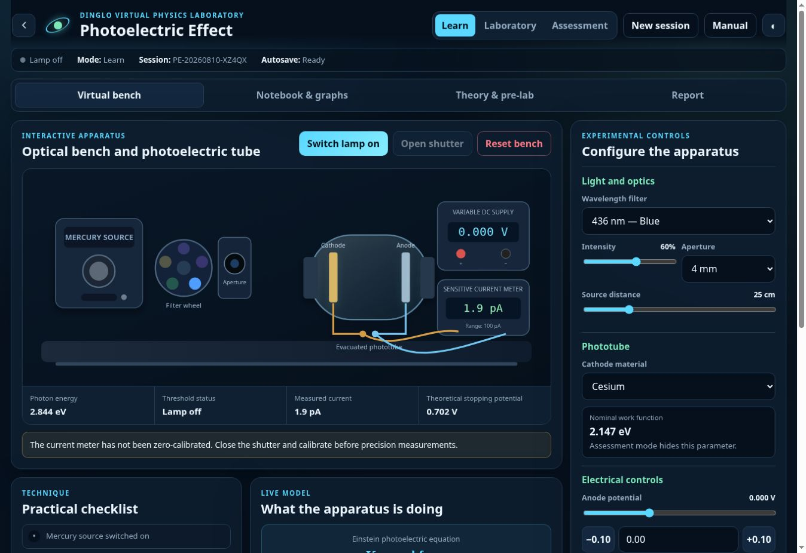
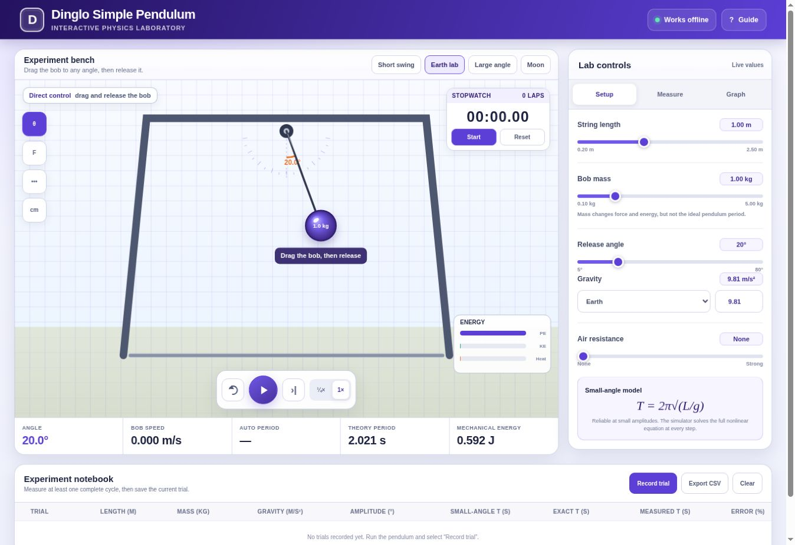

# Dinglo Open Physics Lab

Interactive physics experiments for the browser—built to help students see the equations move, test ideas, and learn by changing real parameters.

> **Source-available collaboration project:** you may use the official simulations and fork the repository to prepare a pull request. Selling, redistributing, rehosting, or reusing the projects elsewhere is not permitted. See [License](#license).

## Try the simulators

### Photoelectric Effect Simulator

[](https://kegodev.github.io/open-physics-lab/)

Explore how wavelength, light intensity, material work function, and stopping voltage affect electron emission and photocurrent.

**[Launch the Photoelectric Effect Simulator →](https://kegodev.github.io/open-physics-lab/)**

### Simple Pendulum Simulator

[](https://kegodev.github.io/open-physics-lab/simple-pendulum/)

Change the pendulum length, gravity, mass, and initial angle; then compare the measured motion with the small-angle model.

**[Launch the Simple Pendulum Simulator →](https://kegodev.github.io/open-physics-lab/simple-pendulum/)**

| Experiment | Concepts | Live simulator |
| --- | --- | --- |
| Photoelectric Effect | Photon energy, work function, stopping potential, photocurrent | [Open simulator](https://kegodev.github.io/open-physics-lab/) |
| Simple Pendulum | Period, gravity, length, angular motion, energy | [Open simulator](https://kegodev.github.io/open-physics-lab/simple-pendulum/) |

## Why contribute?

This repository is designed as a friendly place to make useful pull requests. A contribution can be as focused as fixing one label or as ambitious as adding a complete experiment.

Good first contributions include:

- improving mobile layout, keyboard access, or screen-reader labels;
- correcting an equation, unit, explanation, or graph label;
- adding presets, guided challenges, or classroom questions;
- improving animation performance and numerical accuracy;
- translating simulator text;
- proposing a new browser-based physics experiment.

If you spot something confusing, open an issue. If you can improve it, fork the repository and send a pull request.

## Run locally

No build tools or package installation are required.

1. Fork this repository for the purpose of contributing.
2. Clone your fork and open the project directory.
3. Serve the files with a small local HTTP server, for example `python -m http.server 8000`.
4. Visit `http://localhost:8000` for the photoelectric simulator or `http://localhost:8000/simple-pendulum/` for the pendulum.

Local copies and modifications are permitted only for evaluating the project and preparing a contribution back to this repository, as described in the license.

## Project structure

```text
open-physics-lab/
├── index.html                 # Photoelectric Effect page
├── styles.css                 # Photoelectric Effect styles
├── script.js                  # Photoelectric Effect simulation
├── simple-pendulum/
│   ├── index.html             # Simple Pendulum page
│   ├── styles.css             # Simple Pendulum styles
│   └── script.js              # Simple Pendulum simulation
└── assets/                    # README screenshots
```

Each simulator uses plain HTML, CSS, and JavaScript so contributors can work on one layer without searching through a large framework.

## Contributing

1. Check existing issues or open one describing the change.
2. Create a focused branch in your GitHub fork.
3. Make and test the change locally.
4. Keep simulator HTML, CSS, and JavaScript in separate files.
5. Submit a pull request explaining what changed, why it helps, and how you tested it.

By submitting a contribution, you confirm that it is your original work (or that you have the right to submit it) and accept the contribution terms in the license. **You retain copyright ownership of your original contribution.** Accepted contributions receive attribution through Git history and may be integrated into this repository and its official GitHub Pages deployment.

## License

Copyright in each original contribution remains with the contributor who created it. The combined project may not be sold, commercially used, redistributed, mirrored, rehosted, sublicensed, or copied into another project without the required copyright owners' written permission.

GitHub-hosted viewing and forking rights supplied by GitHub's Terms of Service continue to apply. This repository grants a narrow additional permission to make a fork or temporary local copy solely to evaluate the project and prepare a pull request for this canonical repository.

See the [Dinglo Restricted Collaboration License v1.0](LICENSE) for the complete terms. This is a **source-available license, not an open-source license**.

## Official project locations

- Repository: [github.com/kegodev/open-physics-lab](https://github.com/kegodev/open-physics-lab)
- Photoelectric Effect: [kegodev.github.io/open-physics-lab](https://kegodev.github.io/open-physics-lab/)
- Simple Pendulum: [kegodev.github.io/open-physics-lab/simple-pendulum](https://kegodev.github.io/open-physics-lab/simple-pendulum/)

The word “Open” in the project name describes public access and collaboration; it does not mean that the Work is licensed as open-source software.
