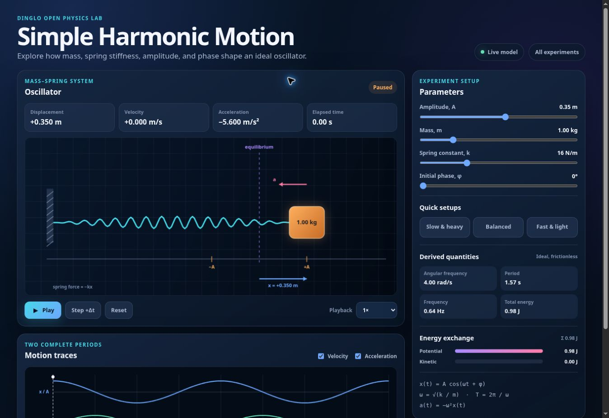

<div align="center">

## Dinglo Open Physics Lab

Physics you can see, change, and test

Browser-based experiments that turn equations into motion. Adjust real parameters, watch each model respond, and build intuition through direct exploration.

<p>
  <a href="https://kegodev.github.io/open-physics-lab/">
    
  </a>
  <a href="#run-locally">
    
  </a>
  <a href="#license">
    
  </a>
</p>

<p>
  
  
  
  
</p>

Experiments · Why contribute · Run locally · Project map · License

</div>

> [!IMPORTANT]
> **This is a source-available collaboration project.** You may use the official simulations and fork the repository to prepare a pull request. Selling, redistributing, rehosting, or reusing the projects elsewhere is not permitted. Read the [license summary](#license) before making a local copy.

────────

 Experiment gallery

Each lab pairs an interactive model with live measurements, graphs, and controls. Start with a familiar equation, then push it until your intuition catches up.

<table>
  <tr>
    <td width="58%">
      <a href="https://kegodev.github.io/open-physics-lab/">
        
      </a>
    </td>
    <td width="42%" valign="top">
      <p><sub>EXPERIMENT 01</sub></p>
      <h3>Photoelectric Effect</h3>
      <p><code>K<sub>max</sub> = hf - &phi;</code></p>
      <p>See how light transfers energy to electrons and produces a measurable photocurrent.</p>
      <p><strong>Adjust</strong><br>wavelength · intensity · work function · stopping voltage</p>
      <p><a href="https://kegodev.github.io/open-physics-lab/"><strong>Launch simulator</strong></a></p>
    </td>
  </tr>
</table>

<table>
  <tr>
    <td width="42%" valign="top">
      <p><sub>EXPERIMENT 02</sub></p>
      <h3>Simple Pendulum</h3>
      <p><code>T &asymp; 2&pi;&radic;(L/g)</code></p>
      <p>Measure oscillation in real time and compare it with the small-angle model.</p>
      <p><strong>Adjust</strong><br>length · gravity · mass · initial angle</p>
      <p><a href="https://kegodev.github.io/open-physics-lab/simple-pendulum/"><strong>Launch simulator</strong></a></p>
    </td>
    <td width="58%">
      <a href="https://kegodev.github.io/open-physics-lab/simple-pendulum/">
        
      </a>
    </td>
  </tr>
</table>

<table>
  <tr>
    <td width="58%">
      <a href="https://kegodev.github.io/open-physics-lab/simple-harmonic-motion/">
        
      </a>
    </td>
    <td width="42%" valign="top">
      <p><sub>EXPERIMENT 03</sub></p>
      <h3>Simple Harmonic Motion</h3>
      <p><code>x(t) = A cos(&omega;t + &phi;)</code></p>
      <p>Follow displacement, velocity, acceleration, and energy through a complete oscillation.</p>
      <p><strong>Adjust</strong><br>amplitude · mass · stiffness · phase · playback speed</p>
      <p><a href="https://kegodev.github.io/open-physics-lab/simple-harmonic-motion/"><strong>Launch simulator</strong></a></p>
    </td>
  </tr>
</table>

<table>
  <tr>
    <td width="20%" align="center">
      <a href="https://kegodev.github.io/open-physics-lab/blackbody-spectrum/">
        
      </a>
    </td>
    <td width="80%" valign="top">
      <p><sub>EXPERIMENT 04</sub></p>
      <h3>Blackbody Spectrum</h3>
      <p><code>&lambda;<sub>max</sub>T = b</code></p>
      <p>Explore the relationship between temperature, emitted spectrum, and the visible-light region.</p>
      <p><a href="https://kegodev.github.io/open-physics-lab/blackbody-spectrum/"><strong>Launch simulator</strong></a></p>
    </td>
  </tr>
</table>

Lab index

|Experiment                |Core ideas                                                            |Live lab                                                                  |
|--------------------------|----------------------------------------------------------------------|:------------------------------------------------------------------------:|
|**Photoelectric Effect**  |Photon energy, work function, stopping potential, photocurrent        |[Open](https://kegodev.github.io/open-physics-lab/)                       |
|**Simple Pendulum**       |Period, gravity, length, angular motion, energy                       |[Open](https://kegodev.github.io/open-physics-lab/simple-pendulum/)       |
|**Simple Harmonic Motion**|Amplitude, angular frequency, phase, spring force, energy conservation|[Open](https://kegodev.github.io/open-physics-lab/simple-harmonic-motion/)|
|**Blackbody Spectrum**    |Temperature, spectrum, visible light                                  |[Open](https://kegodev.github.io/open-physics-lab/blackbody-spectrum/)    |

────────

 Built for active learning

||||
|:-----------------------------------------------------------------------------------------------------------------------------------:|:-------------------------------------------------------------------------------------------------------------------:|:-------------------------------------------------------------------------------------------------------------------------------------------:|
|**Change the model**                                                                                                                 |**Watch the response**                                                                                               |**Compare the physics**                                                                                                                      |
|Work with meaningful physical parameters instead of fixed animations.                                                                |See motion, vectors, energy, and measurements update together.                                                       |Connect the live result to equations, traces, and idealized models.                                                                          |

Every simulator uses plain HTML, CSS, and JavaScript. There is no framework to learn and no build pipeline between an idea and the browser.

 Why contribute?

This repository is designed for focused, useful pull requests. A contribution can be as small as one corrected label or as ambitious as a complete experiment.

|Focus          |Valuable contributions                                                           |
|---------------|---------------------------------------------------------------------------------|
|**Interface**  |Improve mobile layout, keyboard access, screen-reader labels, or control clarity.|
|**Physics**    |Correct an equation, unit, explanation, graph label, or numerical method.        |
|**Learning**   |Add presets, guided challenges, classroom questions, or clearer feedback.        |
|**Performance**|Improve animation smoothness, rendering efficiency, or numerical stability.      |
|**Reach**      |Translate simulator text or propose a new browser-based experiment.              |

If something feels confusing, open an issue. If you can improve it, fork the repository and send a focused pull request.

 Run locally

No package installation or build tools are required.

1. Fork the repository for the purpose of contributing.
2. Clone your fork and enter the project directory.
3. Start a small local HTTP server:
  ```bash
python -m http.server 8000
```
4. Open a simulator route in your browser.

|Route                                          |Experiment            |
|-----------------------------------------------|----------------------|
|`http://localhost:8000/`                       |Photoelectric Effect  |
|`http://localhost:8000/simple-pendulum/`       |Simple Pendulum       |
|`http://localhost:8000/simple-harmonic-motion/`|Simple Harmonic Motion|
|`http://localhost:8000/blackbody-spectrum/`    |Blackbody Spectrum    |

> [!NOTE]
> Local copies and modifications are permitted only for evaluating the project and preparing a contribution back to this repository, as described in the license.

 Project map

```text
open-physics-lab/
├── index.html                 # Photoelectric Effect page
├── styles.css                 # Photoelectric Effect styles
├── script.js                  # Photoelectric Effect simulation
├── simple-pendulum/
│   ├── index.html             # Simple Pendulum page
│   ├── styles.css             # Simple Pendulum styles
│   └── script.js              # Simple Pendulum simulation
├── simple-harmonic-motion/
│   ├── index.html             # Simple Harmonic Motion page
│   ├── styles.css             # Simple Harmonic Motion styles
│   └── script.js              # Simple Harmonic Motion simulation
└── assets/                    # README screenshots
```

The small, predictable structure lets contributors work on markup, styling, or simulation logic without searching through a large framework.

 Contributing

1. Check the existing issues or open one that describes the change.
2. Create a focused branch in your GitHub fork.
3. Make and test the change locally.
4. Keep simulator HTML, CSS, and JavaScript in separate files.
5. Submit a pull request explaining what changed, why it helps, and how you tested it.

By submitting a contribution, you confirm that it is your original work, or that you have the right to submit it, and accept the contribution terms in the license. You retain copyright ownership of your original contribution. Accepted contributions receive attribution through Git history and may be integrated into this repository and its official GitHub Pages deployment.

 License

> **Dinglo Restricted Collaboration License v1.0**  
> Source-available for viewing, learning, evaluation, and contribution preparation. It is **not an open-source license**.

Copyright in each original contribution remains with the contributor who created it. The combined project may not be sold, commercially used, redistributed, mirrored, rehosted, sublicensed, or copied into another project without the required copyright owners’ written permission.

GitHub-hosted viewing and forking rights supplied by GitHub’s Terms of Service continue to apply. This repository grants a narrow additional permission to make a fork or temporary local copy solely to evaluate the project and prepare a pull request for this canonical repository.

Read the complete license before copying or modifying the project.

 Official project locations

|Destination               |Link                                                                                   |
|--------------------------|---------------------------------------------------------------------------------------|
|**Source repository**     |[github.com/kegodev/open-physics-lab](https://github.com/kegodev/open-physics-lab)     |
|**Photoelectric Effect**  |[Open the live lab](https://kegodev.github.io/open-physics-lab/)                       |
|**Simple Pendulum**       |[Open the live lab](https://kegodev.github.io/open-physics-lab/simple-pendulum/)       |
|**Simple Harmonic Motion**|[Open the live lab](https://kegodev.github.io/open-physics-lab/simple-harmonic-motion/)|
|**Blackbody Spectrum**    |[Open the live lab](https://kegodev.github.io/open-physics-lab/blackbody-spectrum/)    |

<p align="center">
  <strong>Change a parameter. Make a prediction. Run the experiment.</strong>
</p>

<p align="center">
  The word “Open” in the project name describes public access and collaboration; it does not mean the work is licensed as open-source software.
</p>
